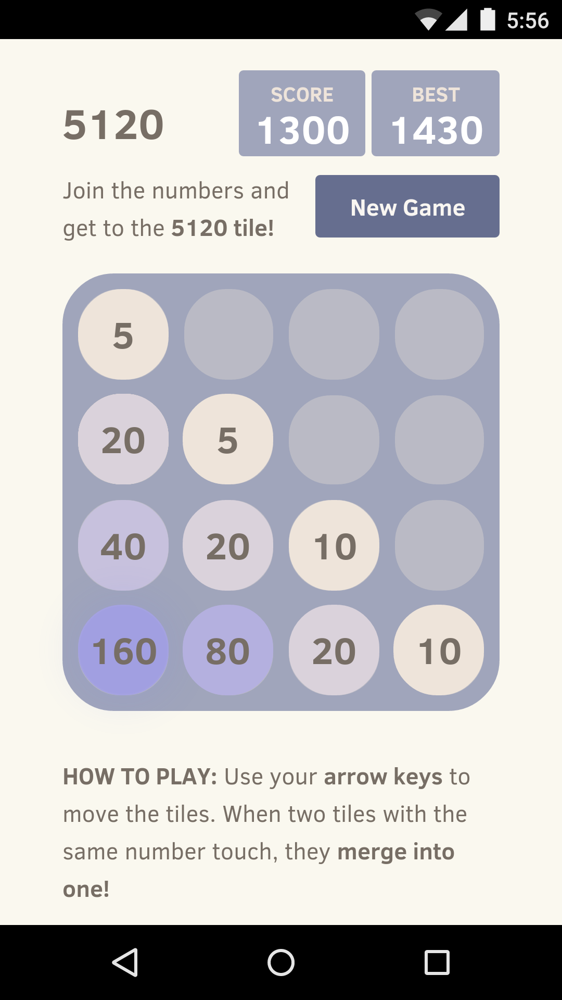

5120-android
============

This is the fork of 2048-android repo https://github.com/uberspot/2048-android/

It includes a variant of the 2048 called 5120 from Mabbu9 https://github.com/Mabbu9/5120

It's nothing fancy, just a webview that loads the locally stored html files of the original game. 
Its playable without Internet (the app doesn't require any permissions)

Play store link: https://play.google.com/store/apps/details?id=com.mabbu9.a5120

##Building

If you want to build from source just do 

    git clone --recursive https://github.com/Mabbu9/5120-android.git
    cd 5120-android/
    ./gradlew build
    
### With Eclipse

1. Copy `https://github.com/Mabbu9/5120-android.git` to clipboard
2. File -> Import -> Git / Projects from Git -> Clone URI
3. Paste URI from clipboard (if it did not appeared automatically)
4. Next> Next> **Check "Clone submodules"**
5. Next> select "Import existing project"       

##License

5120-android is licensed under the [MIT license.](https://github.com/Mabbu9/5120-android/blob/master/LICENSE)
